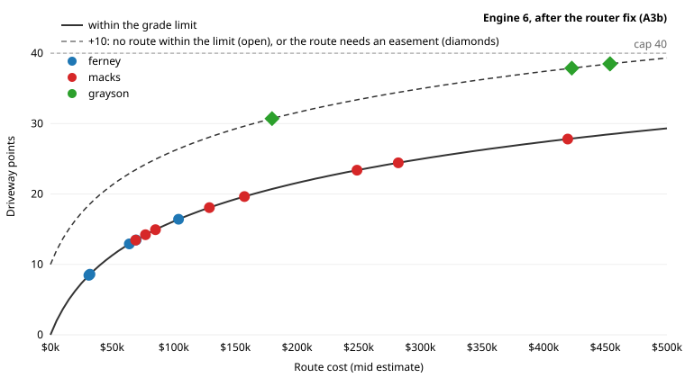

# The driveway points curve: Engine 6, after the router fix (A3b)

Batch A, A3 (owner, 2026-10-09). Every ranked site's driveway is routed (`siteDriveways`), and its points come from
the route's cost estimate (mid):

**points = min(40, 9 · ln(1 + cost / $20,000) + 10 if no route fits the grade limit + 10 if the route needs an easement)**

When no route fits the limit, the least-steep route's cost is used. A site no route reaches at all takes the full
40. Generated by `pnpm a3:curve` (`test/tools/a3-curve.test.ts`) from the pipeline as it now runs.

**Choosing k and c0.** You asked for no ranked fixture site at the cap, and $10k, $50k and $150k clearly apart.
**c0 = $20,000** sets where the curve turns, and **k = 9** sets its height. The costliest
site on the three fixtures has no route within the limit, so it takes the +10 too, and still lands at
38.5 points, under the cap of 40. For comparison, today's linear rule (length / 100 ft) reaches its
30-point maximum at 3,000 ft. The curve keeps separating sites past that.

| Route cost | $10k | $25k | $50k | $100k | $150k | $250k | $400k |
|---|---|---|---|---|---|---|---|
| Points, within the limit | 3.6 | 7.3 | 11.3 | 16.1 | 19.3 | 23.4 | 27.4 |
| Points, no route within the limit | 13.6 | 17.3 | 21.3 | 26.1 | 29.3 | 33.4 | 37.4 |

## Every ranked site on the three fixtures

| Fixture | Rank | Site | Route | Length (ft) | Cost (mid) | Points |
|---|---|---|---|---|---|---|
| ferney | #1 | 18.77 ac | within the limit | 482 | $32k | 8.6 |
| ferney | #2 | 6.06 ac | within the limit | 2377 | $104k | 16.4 |
| ferney | #3 | 2.11 ac shelf | within the limit | 1484 | $64k | 12.9 |
| ferney | #4 | 0.37 ac shelf | within the limit | 1629 | $69k | 13.5 |
| ferney | #5 | 1.12 ac shelf | within the limit | 419 | $31k | 8.5 |
| macks | #1 | 9.61 ac | within the limit | 1133 | $85k | 14.9 |
| macks | #2 | 1.02 ac | within the limit | 4401 | $282k | 24.4 |
| macks | #3 | 9.56 ac | within the limit | 2003 | $129k | 18.1 |
| macks | #4 | 0.73 ac | within the limit | 5427 | $420k | 27.8 |
| macks | #5 | 2.81 ac shelf | within the limit | 784 | $77k | 14.2 |
| macks | #6 | 2.61 ac shelf | within the limit | 738 | $69k | 13.4 |
| macks | #7 | 0.70 ac | within the limit | 2894 | $249k | 23.4 |
| macks | #8 | 4.65 ac shelf | within the limit | 2420 | $157k | 19.6 |
| grayson | #1 | 1.28 ac | within the limit, needs an easement | 5176 | $454k | 38.5 |
| grayson | #2 | 0.24 ac shelf | within the limit, needs an easement | 2307 | $180k | 30.7 |
| grayson | #3 | 0.46 ac shelf | within the limit, needs an easement | 4749 | $423k | 37.9 |
| grayson | #4 | 0.63 ac shelf | within the limit, needs an easement | 5115 | $454k | 38.5 |
