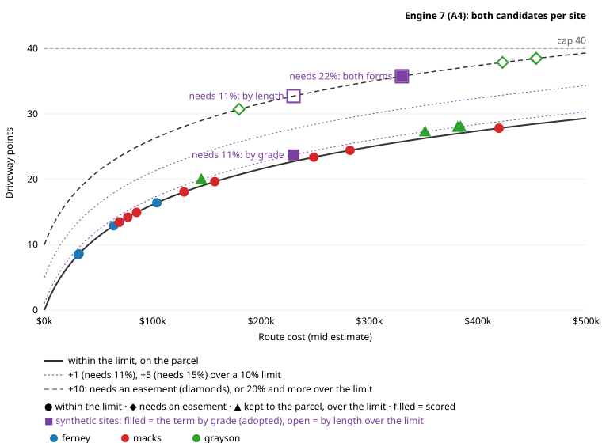

# A4: the driveway (engine 7)

Batch A, A4 (owner, #87 review and re-scope, 2026-10-09). Generated by `pnpm a4:driveway`
(`test/tools/a4-driveway.test.ts`): every fixture screened as the pipeline now runs, and compared with
`origin/main`'s `expected.json`.

## 1. The over-limit term: by grade, not by length

When no route fits the grade limit, A3 added a flat +10. The owner asked (#87) for a term scaled by how far over the
limit the route goes, by whichever of two forms separates a route needing 10.5% from one needing 22%: by length,
10 × min(1, ft over the limit / 1000), or by the grade needed.

**Adopted (owner, #88 review): by grade.** Under a 10% limit: +1 a percent over the limit up to
15% (+5), then straight up to +20 at 20% and above: past the
easement's +10, so a grade that is in practice unpermittable loses to a route through the neighbours at a
similar cost. In `config.ts`: `driveway.practicalMaxPct` = 15, `overLimitPtsPerPct` = 1,
`overLimitMaxAtPct` = 20, `overLimitMaxPts` = 20. Per-county limits are follow-up 46.

| Needs | 11% | 12% | 13% | 14% | 15% | 16% | 17% | 18% | 19% | 20% | 22% |
|---|---|---|---|---|---|---|---|---|---|---|---|
| Points (10% limit) | +1 | +2 | +3 | +4 | +5 | +8 | +11 | +14 | +17 | +20 | +20 |

**The margin isn't a veto.** A route needing 20% or more is 10 points behind an easement route at the
same cost, so it still wins when the cost curve puts it more than 10 points ahead: a 22% route at $50k
(31.3 points) beats an easement route at $300k (35.0).

**Why not by length.** Every route kept to the parcel that needs more than the 10% limit, on the three fixtures now,
and Grayson's with the engine-5 router (the 22% routes, before follow-up 44; measured once, since that router is no
longer in the tree):

| Site | Needs | Length (ft) | Ft over 10% | By length (not adopted) | By grade (adopted) |
|---|---|---|---|---|---|
| grayson #1 (now) | 11% | 4,228 | 3,179 | 10.0 | 1.0 |
| grayson #2 (now) | 11% | 1,434 | 945 | 9.4 | 1.0 |
| grayson #3 (now) | 11% | 3,815 | 2,825 | 10.0 | 1.0 |
| grayson #4 (now) | 11% | 4,184 | 2,943 | 10.0 | 1.0 |
| grayson #1 (engine 5) | 22% | 2,114 | 1,959 | 10.0 | 20.0 |
| grayson #2 (engine 5) | 22% | 1,264 | 1,063 | 10.0 | 20.0 |
| grayson #3 (engine 5) | 22% | 1,787 | 1,772 | 10.0 | 20.0 |
| grayson #4 (engine 5) | 22% | 2,101 | 1,939 | 10.0 | 20.0 |

The length over the limit can't tell the two apart. It is measured on the route's own 3 m profile over a 15 m window,
which on these slopes finds "steeper than 10%" stretches even on a route the router held to 11%. Grayson's #1 kept to
the parcel needs 11% and has 3,179 ft over 10%, more than the 1,959 ft of its
engine-5 route that needed 22%: both would take the full 10.

The synthetic sites (purple squares) are one $200k route needing 11, 15, 18 and 22%: +1, +5,
+14 and +20 (at 22% the total is capped at 40). An easement route at the same cost sits on the
+10 line.

## 2. The scored route: the candidate with fewer points

Each ranked site has two candidates:

- **within the limit:** the cheapest route within the grade limit, wherever it goes, +10 when it needs an
  easement;
- **kept to the parcel:** the cheapest route that keeps to the parcel (outside land only at the entrance), within the
  limit when one is, else the least-steep one, with the over-limit term.

A route within the limit that needs no easement is on the owner's land already, so it is both ("same route"). The
site is scored on the candidate with fewer points; a tie goes to the route within the limit. Points in bold.

| Fixture | Site | Within the limit | Kept to the parcel | Scored | Before (origin/main) | After |
|---|---|---|---|---|---|---|
| ferney | 18.77 ac | ≤ 10%, 482 ft, $32k, **8.6** | same route | — | #1 A 82, 8.6 pts | #1 A 82, 8.6 pts |
| ferney | 6.06 ac | ≤ 10%, 2,377 ft, $104k, **16.4** | same route | — | #2 B 79, 16.4 pts | #2 B 79, 16.4 pts |
| ferney | 2.11 ac shelf | ≤ 10%, 1,484 ft, $64k, **12.9** | same route | — | #3 B 69, 12.9 pts | #3 B 69, 12.9 pts |
| ferney | 0.37 ac shelf | ≤ 10%, 1,629 ft, $69k, **13.5** | same route | — | #4 B 69, 13.5 pts | #4 B 69, 13.5 pts |
| ferney | 1.12 ac shelf | ≤ 10%, 419 ft, $31k, **8.5** | same route | — | #5 B 69, 8.5 pts | #5 B 69, 8.5 pts |
| macks | 9.61 ac | ≤ 10%, 1,133 ft, $85k, **14.9** | same route | — | #1 B 65, 14.9 pts | #1 B 65, 14.9 pts |
| macks | 1.02 ac | ≤ 10%, 4,401 ft, $282k, **24.4** | same route | — | #2 C 63, 24.4 pts | #2 C 63, 24.4 pts |
| macks | 9.56 ac | ≤ 10%, 2,003 ft, $129k, **18.1** | same route | — | #3 C 63, 18.1 pts | #3 C 63, 18.1 pts |
| macks | 0.73 ac | ≤ 10%, 5,427 ft, $420k, **27.8** | same route | — | #4 C 61, 27.8 pts | #4 C 61, 27.8 pts |
| macks | 2.81 ac shelf | ≤ 10%, 784 ft, $77k, **14.2** | same route | — | #5 C 57, 14.2 pts | #5 C 57, 14.2 pts |
| macks | 2.61 ac shelf | ≤ 10%, 738 ft, $69k, **13.4** | same route | — | #6 C 54, 13.4 pts | #6 C 54, 13.4 pts |
| macks | 0.70 ac | ≤ 10%, 2,894 ft, $249k, **23.4** | same route | — | #7 C 53, 23.4 pts | #7 C 53, 23.4 pts |
| macks | 4.65 ac shelf | ≤ 10%, 2,420 ft, $157k, **19.6** | same route | — | #8 C 51, 19.6 pts | #8 C 51, 19.6 pts |
| grayson | 1.28 ac | ≤ 10%, easement, 5,176 ft, $454k, **38.5** | needs 11%, 4,228 ft, $382k, **28.0** | kept to the parcel | #1 C 61, 38.5 pts | **#1 C 64, 28.0 pts** |
| grayson | 0.24 ac shelf | ≤ 10%, easement, 2,307 ft, $180k, **30.7** | needs 11%, 1,434 ft, $145k, **20.0** | kept to the parcel | #2 C 61, 30.7 pts | **#2 C 64, 20.0 pts** |
| grayson | 0.46 ac shelf | ≤ 10%, easement, 4,749 ft, $423k, **37.9** | needs 11%, 3,815 ft, $351k, **27.3** | kept to the parcel | #3 C 57, 37.9 pts | **#3 C 60, 27.3 pts** |
| grayson | 0.63 ac shelf | ≤ 10%, easement, 5,115 ft, $454k, **38.5** | needs 11%, 4,184 ft, $384k, **28.1** | kept to the parcel | #4 C 53, 38.5 pts | **#4 C 55, 28.1 pts** |

**Grayson's #1:** before, scored on the route within 10% through the neighbours (5,176 ft,
38.5 points: the cost curve + 10 for the easement), #1 C 61.
After, scored on the route kept to the parcel (needs 11%, 4,228 ft,
28.0 points: the cost curve + 1), #1 C 64. Its card
appends both, the scored one first. The driveway section is unchanged: it still recommends the route within the limit,
labelled "needs an easement".

## 3. Routing time

Every ranked site's two candidates, in one pass (`siteDriveways`, Node, replayed fixtures): ferney 0.18 s, macks 0.47 s, grayson 0.21 s.
A3b's pass (one candidate) was 0.17, 0.44 and 0.06 s. The budget is 5 s.
