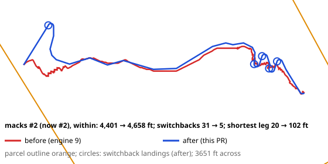
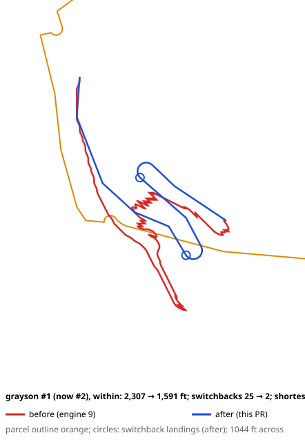
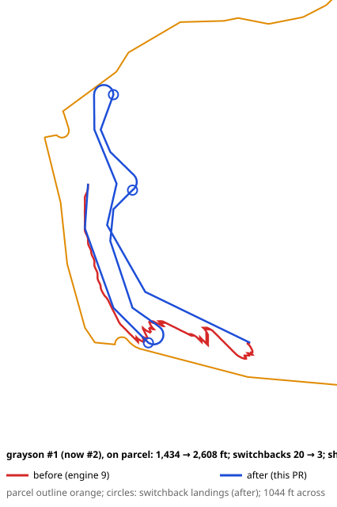
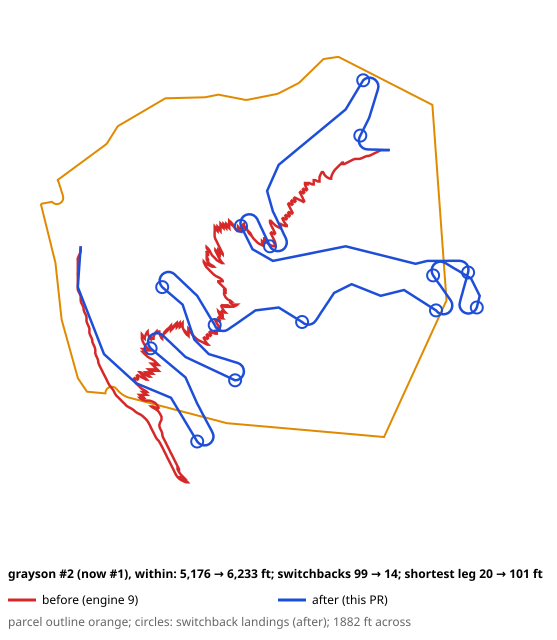
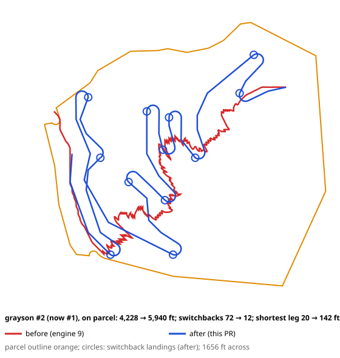

# A4b PR B: the router, as built

Generated by `pnpm a4b:router` (`test/tools/a4b-router.test.ts`) from the three fixtures at engine 10. The
"before" figures are engine 9's (`docs/studies/a4b-router-before.json`, written from main at 55ddad9 before this PR changed anything).

## 1. Routing time (desktop, Node)

The whole driveway step, cold (no estimate cached): every ranked site (both candidates), then site #1's own
driveway (its two kept routes, the direct track). Three runs each, median first. The exact search is the same
search without its speed-ups (no inflated or grade-aware estimate), for reference. The owner's budget: 5 s per
fixture on desktop Node (as A3 measured it); the phone is the owner's check from the preview build.

| Fixture | Sites | Time | Exact search |
|---|---|---|---|
| ferney | 5 | 1.4 s (1.3, 1.4, 1.6) | 2.8 s |
| macks | 8 | 4.9 s (4.9, 4.9, 5.2) | 6.8 s |
| grayson | 4 | 2.3 s (2.3, 2.3, 2.8) | 3.5 s |

## 2. Cost against the exact search

The screen's search inflates its A* estimate by 1.25 (`estimateWeight`), with the grade-aware
estimate. Each route's cost (mid) against the exact search's route to the same site. The largest difference:
macks #7 within, 7.3%.

| Candidate | This PR | Exact search | Difference |
|---|---|---|---|
| ferney #1 within | $32k | $32k | 0.0% |
| ferney #2 within | $101k | $101k | 0.0% |
| ferney #3 within | $64k | $64k | 0.0% |
| ferney #4 within | $74k | $72k | 2.3% |
| ferney #5 within | $32k | $32k | 0.0% |
| macks #1 within | $85k | $85k | 0.0% |
| macks #2 within | $357k | $353k | 1.0% |
| macks #3 within | $145k | $143k | 1.0% |
| macks #4 within | $537k | $534k | 0.5% |
| macks #5 within | $73k | $74k | -0.2% |
| macks #6 within | $311k | $312k | -0.1% |
| macks #7 within | $77k | $72k | 7.3% |
| macks #8 within | $173k | $171k | 1.3% |
| grayson #1 within | $723k | $733k | -1.3% |
| grayson #1 on parcel | $873k | $873k | 0.0% |
| grayson #2 within | $220k | $220k | 0.0% |
| grayson #2 on parcel | $370k | $373k | -0.9% |
| grayson #3 within | $741k | $741k | 0.0% |
| grayson #3 on parcel | $874k | $874k | 0.0% |
| grayson #4 within | $733k | $711k | 3.1% |
| grayson #4 on parcel | $886k | $886k | 0.0% |

## 3. Every candidate, before and after

Matched by the site's position; "#9 → #10" is the site's rank at engine 9 and now. Switchbacks: engine 9's count
(its 15 m turn windows, halved) → the landings this router built. "30 m span": the owner's definition measured on
the drawn line itself (a heading change of 100° or more between 15 m before and after
a point), an independent check of the landing count. "Shortest leg": between two landings, from one turn's end to
the next one's start, along the route (at least 100 ft by construction).

| Candidate | Length (ft) | Cost (mid) | Switchbacks | 30 m span | Shortest leg (ft) | Grade | 30 m grade (%) |
|---|---|---|---|---|---|---|---|
| ferney #1 → #1 within **(scored)** | 482 → 478 | $32k → $32k | 0 → 0 | 0 | — | ≤10% | 5.2 |
| ferney #2 → #2 within **(scored)** | 2,377 → 2,460 | $104k → $101k | 0 → 2 | 1 | 630 | ≤10% | 11.7 |
| ferney #3 → #3 within **(scored)** | 1,484 → 1,447 | $64k → $64k | 0 → 1 | 1 | — | ≤10% | 10.7 |
| ferney #4 → #4 within **(scored)** | 1,629 → 1,643 | $69k → $74k | 0 → 2 | 2 | 105 | ≤10% | 10.0 |
| ferney #5 → #5 within **(scored)** | 419 → 439 | $31k → $32k | 0 → 1 | 1 | — | ≤10% | 9.0 |
| macks #1 → #1 within **(scored)** | 1,133 → 1,116 | $85k → $85k | 0 → 0 | 0 | — | ≤10% | 5.4 |
| macks #2 → #2 within **(scored)** | 4,401 → 4,658 | $282k → $357k | 0 → 5 | 5 | 102 | ≤10% | 10.0 |
| macks #3 → #3 within **(scored)** | 2,003 → 2,221 | $129k → $145k | 0 → 1 | 1 | — | ≤10% | 10.0 |
| macks #4 → #4 within **(scored)** | 5,427 → 6,020 | $420k → $537k | 0 → 6 | 6 | 102 | ≤10% | 12.9 |
| macks #5 → #5 within **(scored)** | 784 → 732 | $77k → $73k | 0 → 0 | 0 | — | ≤10% | 9.6 |
| macks #7 → #6 within **(scored)** | 2,894 → 3,177 | $249k → $311k | 0 → 7 | 7 | 105 | ≤10% | 12.1 |
| macks #6 → #7 within **(scored)** | 738 → 769 | $69k → $77k | 0 → 2 | 2 | 358 | ≤10% | 11.0 |
| macks #8 → #8 within **(scored)** | 2,420 → 2,657 | $157k → $173k | 0 → 1 | 1 | — | ≤10% | 10.0 |
| grayson #2 → #1 within | 5,176 → 6,233 | $454k → $723k | 1 → 14 | 12 | 101 | ≤10% | 13.2 |
| grayson #2 → #1 on parcel **(scored)** | 4,228 → 5,940 | $382k → $873k | 0 → 12 | 11 | 142 | 11% (over) | 15.0 |
| grayson #1 → #2 within **(scored)** | 2,307 → 1,591 | $180k → $220k | 1 → 2 | 2 | 322 | ≤10% | 10.9 |
| grayson #1 → #2 on parcel | 1,434 → 2,608 | $145k → $370k | 0 → 3 | 2 | 295 | 11% (over) | 15.2 |
| grayson #3 → #3 within | 4,749 → 6,184 | $423k → $741k | 1 → 13 | 11 | 101 | ≤10% | 13.2 |
| grayson #3 → #3 on parcel **(scored)** | 3,815 → 5,841 | $351k → $874k | 0 → 11 | 10 | 142 | 11% (over) | 15.0 |
| grayson #4 → #4 within | 5,115 → 6,197 | $454k → $733k | 1 → 14 | 12 | 101 | ≤10% | 13.2 |
| grayson #4 → #4 on parcel **(scored)** | 4,184 → 5,894 | $384k → $886k | 0 → 12 | 11 | 136 | 11% (over) | 15.0 |

## 4. Landings

Each landing is a graded bench: the road holds the grade limit through its 30 ft arc and its
100 ft leg, with at most 3 m of cut or fill. Its volume is the cut or fill between the
ground and the road, a bench (3.66 m) wide; cut below the soils' depth to bedrock is rock. Priced at the
Settings' earthwork rates and included in the route's earthwork and cost.

| Candidate | Landings | Cut and fill (m³) | Of it rock (m³) | Cost | Each (distance along, volume, side slope) |
|---|---|---|---|---|---|
| ferney #2 within | 2 | 127 | 0 | $2k | 893 ft: 67 m³, 10°; 1,582 ft: 61 m³, 16° |
| ferney #3 within | 1 | 57 | 0 | $1k | 879 ft: 57 m³, 8° |
| ferney #4 within | 2 | 191 | 0 | $3k | 1,046 ft: 83 m³, 15°; 1,212 ft: 109 m³, 13° |
| ferney #5 within | 1 | 53 | 0 | $1k | 262 ft: 53 m³, 9° |
| macks #2 within | 5 | 843 | 72 | $21k | 522 ft: 53 m³, 13°; 3,526 ft: 66 m³, 13°; 3,713 ft: 253 m³, 19°; 3,932 ft: 241 m³, 19°; 4,129 ft: 230 m³, 19° |
| macks #3 within | 1 | 53 | 0 | $1k | 522 ft: 53 m³, 13° |
| macks #4 within | 6 | 908 | 89 | $23k | 522 ft: 53 m³, 13°; 3,493 ft: 144 m³, 15°; 3,692 ft: 187 m³, 17°; 3,877 ft: 247 m³, 20°; 4,064 ft: 194 m³, 18°; 4,678 ft: 83 m³, 18° |
| macks #6 within | 7 | 924 | 54 | $20k | 446 ft: 195 m³, 15°; 966 ft: 86 m³, 16°; 1,501 ft: 168 m³, 16°; 1,685 ft: 110 m³, 14°; 2,299 ft: 195 m³, 21°; 2,728 ft: 110 m³, 12°; 2,929 ft: 59 m³, 9° |
| macks #7 within | 2 | 196 | 25 | $6k | 159 ft: 91 m³, 6°; 574 ft: 105 m³, 13° |
| macks #8 within | 1 | 53 | 0 | $1k | 522 ft: 53 m³, 13° |
| grayson #1 within | 14 | 3,056 | 576 | $107k | 828 ft: 178 m³, 26°; 1,279 ft: 293 m³, 21°; 1,662 ft: 256 m³, 26°; 2,134 ft: 320 m³, 20°; 2,447 ft: 114 m³, 18°; 2,786 ft: 70 m³, 26°; 3,332 ft: 159 m³, 14°; 3,530 ft: 300 m³, 23°; 3,819 ft: 275 m³, 11°; 4,016 ft: 259 m³, 20°; 4,882 ft: 289 m³, 22°; 5,074 ft: 256 m³, 22°; 5,846 ft: 197 m³, 18°; 6,094 ft: 90 m³, 12° |
| grayson #1 on parcel | 12 | 2,984 | 1,235 | $173k | 553 ft: 259 m³, 20°; 1,149 ft: 152 m³, 30°; 1,495 ft: 258 m³, 28°; 2,599 ft: 70 m³, 18°; 3,097 ft: 296 m³, 20°; 3,379 ft: 230 m³, 16°; 3,907 ft: 342 m³, 21°; 4,191 ft: 346 m³, 24°; 4,427 ft: 279 m³, 20°; 4,742 ft: 287 m³, 18°; 5,406 ft: 367 m³, 19°; 5,673 ft: 99 m³, 12° |
| grayson #2 within | 2 | 680 | 262 | $37k | 770 ft: 348 m³, 21°; 1,180 ft: 332 m³, 25° |
| grayson #2 on parcel | 3 | 668 | 165 | $27k | 553 ft: 259 m³, 20°; 1,149 ft: 152 m³, 30°; 1,495 ft: 258 m³, 28° |
| grayson #3 within | 13 | 3,161 | 713 | $122k | 828 ft: 178 m³, 26°; 1,279 ft: 293 m³, 21°; 1,662 ft: 256 m³, 26°; 2,134 ft: 320 m³, 20°; 2,447 ft: 114 m³, 18°; 2,786 ft: 70 m³, 26°; 3,332 ft: 159 m³, 14°; 3,530 ft: 300 m³, 23°; 3,819 ft: 275 m³, 11°; 4,016 ft: 259 m³, 20°; 4,882 ft: 289 m³, 22°; 5,074 ft: 256 m³, 22°; 5,737 ft: 392 m³, 19° |
| grayson #3 on parcel | 11 | 2,905 | 1,259 | $174k | 553 ft: 259 m³, 20°; 1,149 ft: 152 m³, 30°; 1,495 ft: 258 m³, 28°; 2,599 ft: 70 m³, 18°; 3,097 ft: 296 m³, 20°; 3,379 ft: 230 m³, 16°; 3,907 ft: 342 m³, 21°; 4,191 ft: 346 m³, 24°; 4,427 ft: 279 m³, 20°; 4,742 ft: 287 m³, 18°; 5,399 ft: 387 m³, 19° |
| grayson #4 within | 14 | 3,215 | 647 | $116k | 828 ft: 178 m³, 26°; 1,279 ft: 293 m³, 21°; 1,662 ft: 256 m³, 26°; 2,134 ft: 320 m³, 20°; 2,447 ft: 114 m³, 18°; 2,786 ft: 70 m³, 26°; 3,332 ft: 159 m³, 14°; 3,530 ft: 300 m³, 23°; 3,819 ft: 275 m³, 11°; 4,016 ft: 259 m³, 20°; 4,882 ft: 289 m³, 22°; 5,074 ft: 256 m³, 22°; 5,754 ft: 293 m³, 15°; 5,963 ft: 153 m³, 16° |
| grayson #4 on parcel | 12 | 3,133 | 1,325 | $184k | 553 ft: 259 m³, 20°; 1,149 ft: 152 m³, 30°; 1,495 ft: 258 m³, 28°; 2,599 ft: 70 m³, 18°; 3,097 ft: 296 m³, 20°; 3,379 ft: 230 m³, 16°; 3,907 ft: 342 m³, 21°; 4,191 ft: 346 m³, 24°; 4,427 ft: 279 m³, 20°; 4,742 ft: 287 m³, 18°; 5,406 ft: 361 m³, 19°; 5,637 ft: 254 m³, 17° |

## 5. Landings refused for the side slope

No landing is built where the natural side slope under its arc is over 35° (it would need
retaining walls). Routed again with that limit lifted, these landings would have been used:

| Candidate | At | Side slope | Where | Without it |
|---|---|---|---|---|
| (none on the fixtures) | | | | |

## 6. Drawings

Hillshade from the 3 m DEM. Red: engine 9's route as drawn. Blue: this PR's, with its landings circled.

**macks #2 (now #2), within: 4,401 → 4,658 ft; switchbacks 31 → 5; shortest leg 20 → 102 ft.** 30 m-span switchbacks on the line: 31 before, 5 after.

**grayson #1 (now #2), within: 2,307 → 1,591 ft; switchbacks 25 → 2; shortest leg 20 → 322 ft.** 30 m-span switchbacks on the line: 25 before, 2 after.

**grayson #1 (now #2), on parcel: 1,434 → 2,608 ft; switchbacks 20 → 3; shortest leg 20 → 295 ft.** 30 m-span switchbacks on the line: 20 before, 2 after.

**grayson #2 (now #1), within: 5,176 → 6,233 ft; switchbacks 99 → 14; shortest leg 20 → 101 ft.** 30 m-span switchbacks on the line: 99 before, 12 after.

**grayson #2 (now #1), on parcel: 4,228 → 5,940 ft; switchbacks 72 → 12; shortest leg 20 → 142 ft.** 30 m-span switchbacks on the line: 72 before, 11 after.

