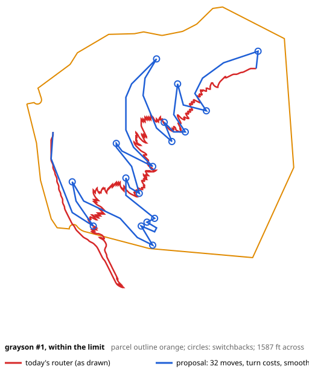
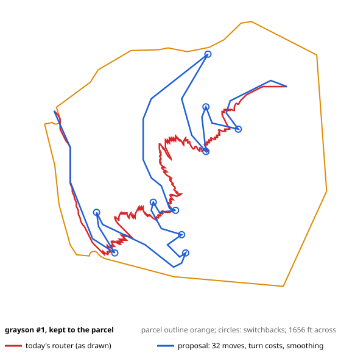
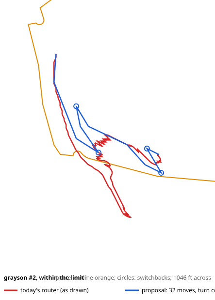
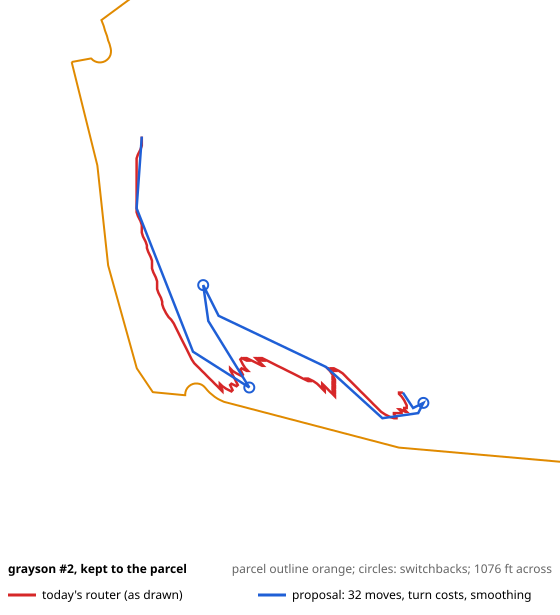
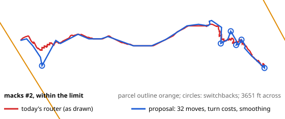

# A4b: the driveway router's realism (report only)

Batch A, A4b (owner, 2026-10-09). Generated by `pnpm a4b:realism` (`test/tools/a4b-realism.test.ts`) from the
three fixtures as the pipeline runs today (engine 8). Nothing in `lib/` changes: the route quantities are re-measured
by a copy of the router's formula, checked equal to the router's own on all 21 candidate routes (length to
1e-6 ft, cost to 1e-9 relative, switchbacks exactly) before anything below is computed.

Every candidate is listed: each ranked site's route within the limit, and its route kept to the parcel where that's a
different route (Grayson's four). "(scored)" marks the one the site is scored on.

## 1. The reported maximum grade, measured the way the limit is enforced

**How the limit is enforced.** The router (`routeMany`) moves between 3 m DEM cell centres in 16 directions: 8
neighbours and 8 knight's moves, 3.0, 4.2 and 6.7 m long. A move is allowed only when the rise between its two cell
centres, over the move's length, is within the limit. The elevations in between are never looked at, and nothing is
smoothed.

**How the max grade is measured.** After routing, the cell path is smoothed once (Chaikin, cutting each corner), and the
smoothed line is sampled every 3 m. Each sample takes the elevation of the cell it falls in (nearest cell, no
interpolation). The reported maximum is the steepest pair of consecutive samples.

The two can't agree:

- **Nearest-cell sampling.** A 3 m sample on a 3 m grid either stays in the same cell (0%) or steps a whole cell. On a
  side slope the smoothed line drifts up to about a metre off the cells the router checked, and the next sample can land
  in the cell above or below the path, 2–3 m higher or lower. That reads as a 50%-plus "grade" over 3 m on a path that
  runs across the slope.
- **The smoothing shortens the zigzag.** Where the slope is steeper than the limit, the router climbs by alternating two
  directions (for example 27° and 45° off the contour), each move within the limit. Smoothing cuts those corners, so the
  same rise is spread over less distance. Over 15–30 m the smoothed line really is steeper than the limit: up to
  12.4% over 30 m across all the candidates.
- **Even the router's own cell path goes slightly over the limit** when its ground is read between cell centres (last
  column: up to 11.9% over 15 m). A 6.7 m knight's move only compares
  its two end cells, and it crosses terrain the router never sees.

**Grayson's route through the neighbours (#1's, within 10%, the one in your screenshot):**
- **Reported today:** 58.4%.
- **With interpolated elevations:** the steepest 3 m step is 24.9%.
- **Over windows:** 14.4% over 15 m (at 462 m along), 11.6%
  over 30 m, 10.6% over 60 m.

The 58% sample is about 276 m along, off the parcel, where the route runs across a 17–27° side slope. The sample read
the cell above the path, so it is not a 58% grade. The 14.4% over 15 m is real, though: it's the
smoothing taking the zigzag out.

**The fix (proposed for the implementation):** report, and later veto on, the grade over set distances along the
smoothed route, with elevations interpolated between cell centres. The windows are 15, 30 and 60 m, with 30 m as the
headline. The steepest single 3 m step stops being reported.

| Candidate | Limit or needed | Reported max (3 m, nearest cell) | 3 m, interpolated | 15 m | 30 m | 60 m | The router's cell path, 15 / 30 / 60 m |
|---|---|---|---|---|---|---|---|
| ferney #1 within **(scored)** | 10% | 19.2 | 8.6 | 5.4 | 5.0 | 4.1 | 5.5 / 5.1 / 4.1 |
| ferney #2 within **(scored)** | 10% | 35.5 | 18.0 | 12.1 | 11.3 | 10.5 | 9.9 / 9.1 / 8.6 |
| ferney #3 within **(scored)** | 10% | 20.5 | 11.5 | 10.1 | 9.4 | 9.1 | 9.8 / 9.2 / 8.7 |
| ferney #4 within **(scored)** | 10% | 31.2 | 17.3 | 12.1 | 11.3 | 10.0 | 10.7 / 9.9 / 9.0 |
| ferney #5 within **(scored)** | 10% | 20.9 | 12.7 | 10.1 | 9.3 | 8.8 | 9.4 / 9.0 / 8.6 |
| macks #1 within **(scored)** | 10% | 17.3 | 7.0 | 5.8 | 5.3 | 4.3 | 5.7 / 5.2 / 4.3 |
| macks #2 within **(scored)** | 10% | 34.0 | 15.0 | 11.4 | 10.8 | 10.0 | 9.6 / 9.2 / 8.9 |
| macks #3 within **(scored)** | 10% | 25.5 | 14.3 | 10.9 | 10.5 | 10.0 | 9.6 / 9.2 / 8.9 |
| macks #4 within **(scored)** | 10% | 39.2 | 16.9 | 11.9 | 10.8 | 10.0 | 9.6 / 9.3 / 8.9 |
| macks #5 within **(scored)** | 10% | 26.3 | 12.5 | 10.3 | 8.5 | 7.9 | 9.1 / 8.0 / 7.4 |
| macks #6 within **(scored)** | 10% | 25.5 | 13.8 | 10.6 | 10.3 | 9.7 | 9.6 / 8.7 / 8.2 |
| macks #7 within **(scored)** | 10% | 40.9 | 17.5 | 12.4 | 10.9 | 10.2 | 9.9 / 9.6 / 8.7 |
| macks #8 within **(scored)** | 10% | 25.5 | 14.3 | 10.9 | 10.5 | 10.0 | 9.6 / 9.2 / 8.9 |
| grayson #1 within, easement | 10% | 58.4 | 24.9 | 14.4 | 11.6 | 10.6 | 11.9 / 10.3 / 8.7 |
| grayson #1 on parcel **(scored)** | 11% | 58.4 | 26.2 | 14.7 | 12.4 | 11.6 | 11.8 / 10.2 / 9.1 |
| grayson #2 within, easement | 10% | 58.4 | 24.9 | 14.4 | 11.1 | 10.4 | 10.0 / 9.3 / 7.9 |
| grayson #2 on parcel **(scored)** | 11% | 105.4 | 23.0 | 14.8 | 12.0 | 11.6 | 10.6 / 10.0 / 8.9 |
| grayson #3 within, easement | 10% | 58.4 | 24.9 | 14.4 | 11.6 | 10.6 | 11.9 / 10.3 / 8.7 |
| grayson #3 on parcel **(scored)** | 11% | 58.4 | 26.2 | 14.7 | 12.4 | 11.6 | 11.8 / 10.2 / 8.9 |
| grayson #4 within, easement | 10% | 58.4 | 24.9 | 14.4 | 11.6 | 10.6 | 11.9 / 10.3 / 8.7 |
| grayson #4 on parcel **(scored)** | 11% | 58.4 | 26.2 | 14.7 | 12.4 | 11.6 | 11.8 / 10.2 / 8.9 |

All grades are in percent. The windows are on the smoothed line, with interpolated elevations.

## 2. Zigzag inflation: the reported length is short, not long

**What's compared.** The router's reported length (the smoothed line) against a simplified alignment. The simplified
alignment is the router's cell path through Douglas–Peucker, kept within 5 m of it, with every straight
leg's grade checked against the limit (endpoint to endpoint) and split again where it's too steep. That's an alignment a
dozer can follow at the grade limit. Length and cost are both measured with the router's formula. The cost includes the
fixed charges (mobilisation, entrance, erosion control), so it moves less than the length.

**The zigzag isn't inflating the length; the smoothing is deflating it.** Where the slope is gentle, the simplified
alignment is about as long as the reported one. Where it's steep, holding the limit on straight legs keeps most of the
switching, and the alignment is longer than the reported line:

| Where | Length | Cost |
|---|---|---|
| Ferney and Macks | -3.9% to 7.6% | -1.9% to 9.8% |
| Grayson | 5.3% to 16.6% | 6.9% to 20.9% |

So today's length and cost understate the steep routes, and the 30 m grade is overstated (§1).

| Candidate | Router length (ft) | Simplified (ft) | Length | Cost (mid) | Legs | Simplified, 15 / 30 / 60 m grade |
|---|---|---|---|---|---|---|
| ferney #1 within **(scored)** | 482 | 475 | -1.3% | $32k → $32k (-0.3%) | 2 | 5.2 / 4.6 / 4.0 |
| ferney #2 within **(scored)** | 2,377 | 2,517 | 5.9% | $104k → $105k (1.5%) | 49 | 12.9 / 11.4 / 9.6 |
| ferney #3 within **(scored)** | 1,484 | 1,460 | -1.6% | $64k → $63k (-1.1%) | 13 | 11.1 / 9.4 / 9.0 |
| ferney #4 within **(scored)** | 1,629 | 1,709 | 5.0% | $69k → $72k (4.0%) | 36 | 12.5 / 11.2 / 10.7 |
| ferney #5 within **(scored)** | 419 | 402 | -3.9% | $31k → $31k (-1.7%) | 3 | 11.1 / 10.9 / 9.1 |
| macks #1 within **(scored)** | 1,133 | 1,123 | -0.8% | $85k → $85k (0.2%) | 5 | 6.8 / 5.3 / 4.3 |
| macks #2 within **(scored)** | 4,401 | 4,484 | 1.9% | $282k → $290k (2.7%) | 76 | 12.8 / 11.2 / 10.1 |
| macks #3 within **(scored)** | 2,003 | 2,007 | 0.2% | $129k → $131k (1.3%) | 33 | 12.8 / 11.2 / 10.1 |
| macks #4 within **(scored)** | 5,427 | 5,838 | 7.6% | $420k → $461k (9.8%) | 157 | 13.3 / 10.8 / 9.1 |
| macks #5 within **(scored)** | 784 | 767 | -2.2% | $77k → $76k (-1.9%) | 6 | 9.6 / 9.2 / 8.7 |
| macks #6 within **(scored)** | 738 | 757 | 2.6% | $69k → $70k (1.5%) | 21 | 12.8 / 11.2 / 10.1 |
| macks #7 within **(scored)** | 2,894 | 3,049 | 5.4% | $249k → $262k (5.3%) | 73 | 12.9 / 10.6 / 9.6 |
| macks #8 within **(scored)** | 2,420 | 2,444 | 1.0% | $157k → $160k (2.0%) | 36 | 11.7 / 10.2 / 9.1 |
| grayson #1 within, easement | 5,176 | 5,861 | 13.2% | $454k → $524k (15.5%) | 170 | 17.8 / 13.3 / 9.8 |
| grayson #1 on parcel **(scored)** | 4,228 | 4,817 | 13.9% | $382k → $451k (18.1%) | 155 | 15.2 / 12.6 / 10.5 |
| grayson #2 within, easement | 2,307 | 2,438 | 5.7% | $180k → $196k (9.3%) | 47 | 18.0 / 12.3 / 10.2 |
| grayson #2 on parcel **(scored)** | 1,434 | 1,510 | 5.3% | $145k → $155k (6.9%) | 35 | 23.8 / 16.1 / 11.0 |
| grayson #3 within, easement | 4,749 | 5,396 | 13.6% | $423k → $490k (16.0%) | 161 | 17.8 / 13.3 / 9.8 |
| grayson #3 on parcel **(scored)** | 3,815 | 4,448 | 16.6% | $351k → $425k (20.9%) | 151 | 23.5 / 12.6 / 10.5 |
| grayson #4 within, easement | 5,115 | 5,772 | 12.8% | $454k → $522k (15.0%) | 164 | 17.8 / 13.3 / 9.8 |
| grayson #4 on parcel **(scored)** | 4,184 | 4,759 | 13.8% | $384k → $452k (17.6%) | 148 | 15.2 / 12.6 / 10.5 |

## 3. A router proposal

Prototyped here (`routeWithTurns`), not in the engine. Each search state carries the heading it arrived on:

- **A turn penalty:** a change of heading costs 3 m of base cost per 45°.
- **A switchback landing:** a turn sharper than 100° costs another 30 m, since a landing
  has to be built.
- **32 directions instead of 16:** adds the (3,1) and (3,2) moves, at 18° and 34° off the axes. With today's 16, the
  only way to hold the limit at an angle in between is to alternate two directions. A turn penalty alone can't remove
  that zigzag; it only trades it for a longer route. The 16-direction column below shows this.
- **Post-route smoothing with a grade re-check:** §2's simplification of the new path. Length and cost are measured on
  the smoothed path.

Each column below reads "today simplified / 16 directions with turn costs / 32 directions with turn costs", all three
after §2's smoothing:

| Candidate | Length (ft) | Cost (mid) | Switchbacks | Shortest leg between switchbacks (ft) | 30 m grade | Routing time |
|---|---|---|---|---|---|---|
| ferney #1 within **(scored)** | 475 / 481 / 478 | $32k / $32k / $32k | 0 / 0 / 0 | — / — / — | 4.6 / 5.4 / 5.2 | 0.05 / 0.11 s |
| ferney #2 within **(scored)** | 2,517 / 2,685 / 2,385 | $105k / $106k / $96k | 37 / 1 / 0 | 10 / — / — | 11.4 / 11.4 / 11.4 | 0.50 / 1.74 s |
| ferney #3 within **(scored)** | 1,460 / 1,524 / 1,385 | $63k / $65k / $61k | 1 / 1 / 0 | — / — / — | 9.4 / 10.9 / 10.2 | 0.24 / 0.84 s |
| ferney #4 within **(scored)** | 1,709 / 1,901 / 1,762 | $72k / $79k / $75k | 26 / 1 / 0 | 10 / — / — | 11.2 / 10.9 / 11.0 | 0.32 / 1.15 s |
| ferney #5 within **(scored)** | 402 / 413 / 402 | $31k / $31k / $30k | 1 / 1 / 1 | — / — / — | 10.9 / 10.8 / 11.3 | 0.07 / 0.22 s |
| macks #1 within **(scored)** | 1,123 / 1,126 / 1,116 | $85k / $84k / $85k | 0 / 0 / 0 | — / — / — | 5.3 / 4.9 / 5.4 | 0.07 / 0.22 s |
| macks #2 within **(scored)** | 4,484 / 4,925 / 4,468 | $290k / $334k / $301k | 57 / 12 / 6 | 10 / 50 / 106 | 11.2 / 10.6 / 11.1 | 0.32 / 1.24 s |
| macks #3 within **(scored)** | 2,007 / 2,217 / 2,007 | $131k / $153k / $137k | 24 / 2 / 1 | 10 / 387 / — | 11.2 / 10.1 / 11.4 | 0.15 / 0.57 s |
| macks #4 within **(scored)** | 5,838 / 6,647 / 5,758 | $461k / $561k / $467k | 136 / 37 / 11 | 10 / 22 / 89 | 10.8 / 13.5 / 11.5 | 0.45 / 1.88 s |
| macks #5 within **(scored)** | 767 / 842 / 730 | $76k / $86k / $73k | 2 / 0 / 0 | 20 / — / — | 9.2 / 9.1 / 10.8 | 0.07 / 0.22 s |
| macks #6 within **(scored)** | 757 / 892 / 793 | $70k / $85k / $75k | 19 / 1 / 2 | 10 / — / 388 | 11.2 / 10.1 / 10.5 | 0.06 / 0.19 s |
| macks #7 within **(scored)** | 3,049 / 3,528 / 3,097 | $262k / $319k / $292k | 60 / 16 / 9 | 10 / 22 / 110 | 10.6 / 12.1 / 11.8 | 0.32 / 1.39 s |
| macks #8 within **(scored)** | 2,444 / 2,636 / 2,441 | $160k / $179k / $163k | 24 / 2 / 1 | 10 / 383 / — | 10.2 / 10.1 / 10.8 | 0.19 / 0.76 s |
| grayson #1 within, easement | 5,861 / 6,704 / 5,062 | $524k / $643k / $553k | 157 / 42 / 17 | 10 / 20 / 44 | 13.3 / 15.2 / 13.0 | 0.11 / 0.46 s |
| grayson #1 on parcel **(scored)** | 4,817 / 5,421 / 4,558 | $451k / $558k / $489k | 143 / 27 / 10 | 10 / 44 / 137 | 12.6 / 12.3 / 14.5 | 0.12 / 0.48 s |
| grayson #2 within, easement | 2,438 / 2,644 / 1,563 | $196k / $219k / $194k | 38 / 14 / 4 | 10 / 35 / 137 | 12.3 / 15.2 / 11.2 | 0.04 / 0.11 s |
| grayson #2 on parcel **(scored)** | 1,510 / 1,665 / 1,372 | $155k / $185k / $169k | 30 / 6 / 3 | 10 / 75 / 220 | 16.1 / 12.6 / 11.8 | 0.03 / 0.11 s |
| grayson #3 within, easement | 5,396 / 6,110 / 4,617 | $490k / $588k / $518k | 148 / 44 / 17 | 10 / 20 / 44 | 13.3 / 15.2 / 12.6 | 0.10 / 0.40 s |
| grayson #3 on parcel **(scored)** | 4,448 / 5,011 / 4,181 | $425k / $533k / $460k | 142 / 24 / 10 | 10 / 44 / 137 | 12.6 / 12.3 / 13.7 | 0.10 / 0.43 s |
| grayson #4 within, easement | 5,772 / 6,485 / 4,919 | $522k / $627k / $543k | 149 / 43 / 16 | 10 / 20 / 44 | 13.3 / 15.2 / 12.6 | 0.10 / 0.43 s |
| grayson #4 on parcel **(scored)** | 4,759 / 5,349 / 4,428 | $452k / $559k / $488k | 137 / 25 / 9 | 10 / 44 / 137 | 12.6 / 12.3 / 14.5 | 0.12 / 0.48 s |

**Results with 32 directions:**
- **Far fewer switchbacks:**
  - Grayson's route through the neighbours: 157 → 17.
  - Macks #2: 57 → 6, with 106 ft as the shortest leg between switchbacks.
- **Lengths:** about today's simplified alignment, or shorter.
- **Short legs remain:** 4 candidates still have a leg under 100 ft between switchbacks (macks #4 within **(scored)**; grayson #1 within, easement; grayson #3 within, easement; grayson #4 within, easement).

**What the prototype doesn't do yet:**
- **Enforce the 100 ft minimum leg.** The search would have to carry the distance since the last switchback,
  or a second pass would repair short legs.
- **Check a switchback's radius.** That needs the terrain over the landing's footprint at each switchback.
- **Check the ground under a long move.** A 3-cell move compares only its end cells, 9.5 m apart, so it can step over a
  bank. Some of the shorter Grayson routes may be using that. The implementation would check the cells it crosses.

**Grade on the ground vs the road's grade.** The proposal's legs hold the limit endpoint to endpoint, but the ground
along a straight leg undulates: 5.2% to 14.5% over 30 m on the ground under the 32-direction alignments. A built road
grades that out with cut and fill. So the veto's measure (§4) should probably read the road's designed profile (the legs)
once the router designs one, and the ground until then. That's a question for you.

**Routing time.**
- **Prototype, one route at a time:** per fixture, ferney 1.2 s (16 moves) / 4.1 s (32), macks 1.6 s (16 moves) / 6.5 s (32), grayson 0.7 s (16 moves) / 2.9 s (32).
- **Today, every site's two candidates in one multi-target pass:** 0.20, 0.48 and 0.23 s.
- **In the engine:** today's shared multi-target search (one pass per entrance and style for every site) would
  recover much of that, but a heading per state and 32 directions mean 32 times the states and twice the moves per state. The slowest
  fixture took 6.5 s one route at a time with 32 directions, so staying inside the 5 s budget likely
  needs A* toward the targets, or headings kept only for the 16 nearest moves. The implementation would measure it.

**Drawings.** The background is a hillshade from the 3 m DEM. Red is today's route as drawn; blue is the 32-direction
proposal after smoothing, with its switchbacks circled.

## 4. The veto: `driveway.vetoGradePct` = 20 over a 30 m window

The rule (owner, #89 review): a candidate whose grade over a 30 m window goes above 20% isn't eligible, whatever
its cost. If every candidate is vetoed, the least-bad one is shown under a "no practical route found" flag. Simulated
with §1's measure (the smoothed route, interpolated elevations):

| Site | Candidates, 30 m grade | Scored today | With the veto |
|---|---|---|---|
| ferney #1 | within 5.0% | within | same |
| ferney #2 | within 11.3% | within | same |
| ferney #3 | within 9.4% | within | same |
| ferney #4 | within 11.3% | within | same |
| ferney #5 | within 9.3% | within | same |
| macks #1 | within 5.3% | within | same |
| macks #2 | within 10.8% | within | same |
| macks #3 | within 10.5% | within | same |
| macks #4 | within 10.8% | within | same |
| macks #5 | within 8.5% | within | same |
| macks #6 | within 10.3% | within | same |
| macks #7 | within 10.9% | within | same |
| macks #8 | within 10.5% | within | same |
| grayson #1 | within 11.6%; on parcel 12.4% | on parcel | same |
| grayson #2 | within 11.1%; on parcel 12.0% | on parcel | same |
| grayson #3 | within 11.6%; on parcel 12.4% | on parcel | same |
| grayson #4 | within 11.6%; on parcel 12.4% | on parcel | same |

**No fixture candidate is vetoed.** The steepest 30 m window on any of them is 12.4%, under 20%.

**Grayson's route through the neighbours:** 14.4 / 11.6 / 10.6% over
15 / 30 / 60 m, against 58.4% reported today. The veto **would not remove it**.

The veto is aimed at the case you named, a 22% route at $50k beating an easement route at $300k. On the three fixtures
it removes nothing, because no fixture route is that steep once it's measured this way.

## 5. What implementation would change (for your go)

1. **Measure.** The route's reported grades become the 15, 30 and 60 m windows above: the driveway card's "Grade, max /
   average" row and the over-limit stretches. A declared numbers change, with the report text appended, not replaced
   (rule 7).
2. **Veto.** `driveway.vetoGradePct` = 20 goes in `config.ts` and Settings, and applies to both candidates
   before `chooseDriveway`. "No practical route found" becomes a flag.
3. **Router:**
   - 32 directions, with the cells under each long move checked;
   - the heading-aware turn penalty and the switchback landing;
   - the post-route smoothing with its grade re-check;
   - length and cost taken from the smoothed path;
   - the multi-target search kept, with A* or a reduced heading set to stay in the 5 s budget.
   - **Constants to settle with you:**
     - 3 m per 45° of turn;
     - 30 m per switchback;
     - the 100 ft minimum leg (enforced);
     - a switchback radius. Fire-access codes often ask for about 25–30 ft inside radius; follow-up 46 checks the six
       counties.
4. **Your question:** the veto and the reported grade read the ground under the route (as now) or, once the router
   designs legs, the road's designed profile.
5. **Unit costs** stay as they are until follow-up 47, which calibrates them against the corrected lengths. §2 shows
   the steep routes' lengths rising by up to 16.6%.
